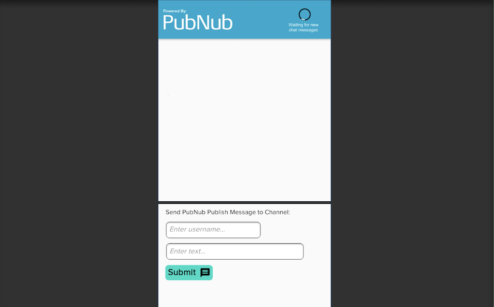

# PubNub Unity Sample App

This repository contains the files required to run the [PubNub Unity Quickstart](https://www.pubnub.com/docs/platform/quickstarts/unity).

PubNub takes care of the infrastructure and APIs needed for the realtime communication layer of your application. Work on your app's logic and let PubNub handle sending and receiving data across the world in less than 100ms.

## Get keys

You will need publish and subscribe keys to authenticate your app. Get your keys from the [Admin Portal](https://dashboard.pubnub.com/login).

## Set up the project

Clone the repository and use the files in there.
 
1. Download and install [Unity](https://store.unity.com/). 
2. In Unity, create a new 2d project called `pnquickstart`.
3. Clone this repository.
4. In Unity Editor, open the `pnquickstart` project, navigate to Assets -> Import Package -> Custom Package and import the `unity-pubnub-realtime-chat.unitypackage` file you can find in your cloned repository.
5. Navigate to Window -> General -> Test Runner, click the 3 vertical dots icon next to the window close button and click Enable playmode tests for all assemblies.
6. Restart Unity editor.

## Add project files

All the files are included in the `unity-pubnub-realtime-chat.unitypackage` file you imported. You don't need to add any other files.

## Run the app

1. Navigate to Assets -> Scenes, double-click the `RealtimeChat.unity` scene, and click the Run button.

    The chat messages will appear in the middle of the screen and are removed from the UI once they no longer fit on the screen.

    

    The UI is simple but uses a list view that cleanly displays each event.

2. Submit a new entry.

## Documentation

* [Build your first realtime Unity app with PubNub](https://www.pubnub.com/docs/platform/quickstarts/unity)
* [API reference for Unity](https://www.pubnub.com/docs/unity3d-c-sharp/pubnub-c-sharp-sdk)

## Support

If you **need help** or have a **general question**, contact support@pubnub.com.
